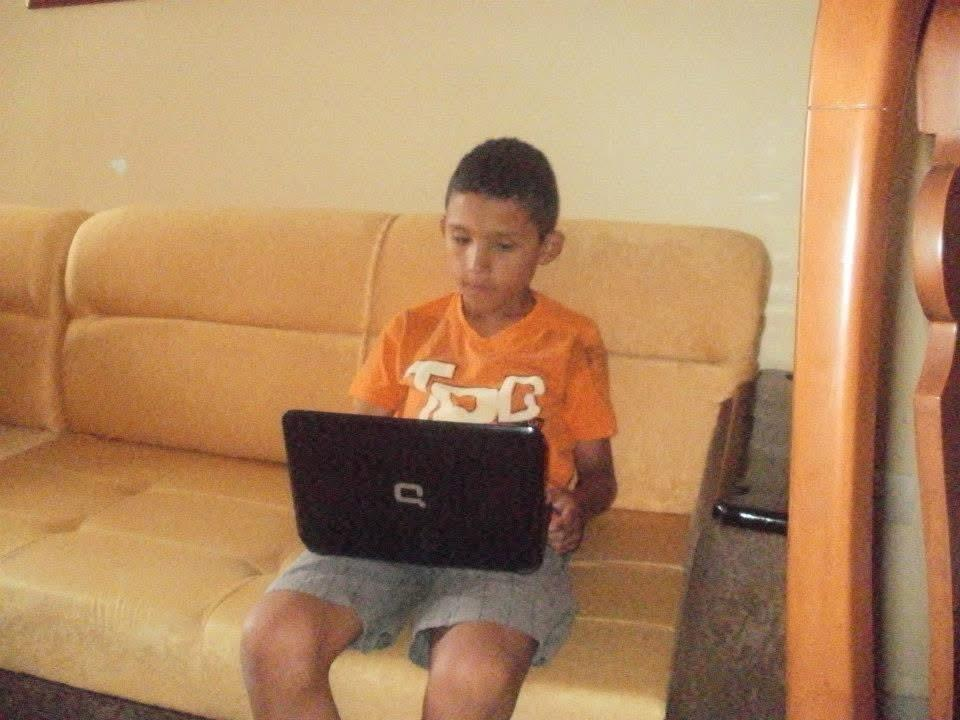
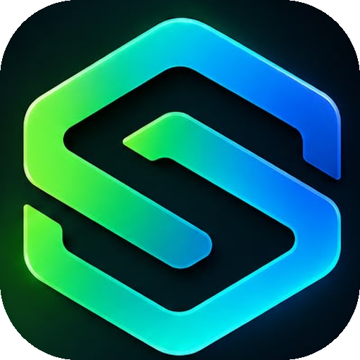

<div align="center">

<!-- ═══════════════════════════════════════════════════════════════ -->

<!--                         ANIMATED HERO                           -->

<!-- ═══════════════════════════════════════════════════════════════ -->



<br><br>


<br>


<br><br>

<a href="https://github.com/REKOL08">

</a>

<a href="https://github.com/REKOL08?tab=repositories">

</a>

<a href="https://orcid.org/0009-0007-1830-1054">

</a>

<a href="https://linkedin.com/in/alejandro-labrada-jimenez-a79768253">

</a>

</div>

---

<div align="center">

## `> whoami`

</div>

```yaml
name: Alejandro Labrada
role: AI Developer & Technical Library Specialist
organization: Fundación Universitaria del Área Andina — Areandina
team: BIDIG · Library Innovation
education: Systems Engineering — 7th semester
location: Colombia

focus:
  - Artificial Intelligence
  - Library Technology
  - Data Analytics
  - Automation
  - Bibliometrics
  - Research Technology
  - Web Development

mission: >
  Turn institutional data, repetitive workflows and information
  resources into useful technology for people.
```

<div align="center">

### `I build at the intersection of`

# 🤖 AI  ×  📚 LIBRARIES  ×  📊 DATA  ×  ⚙️ AUTOMATION

</div>

---

<div align="center">

## `> tech.stack()`

<br>


<br><br>


</div>

---

<div align="center">

## `> what.i.build`

</div>

<table>
<tr>
<td width="50%" valign="top">

### 🤖 Artificial Intelligence

AI assistants, intelligent workflows, research support tools and AI-powered educational experiences.

</td>

<td width="50%" valign="top">

### 📚 Library Technology

Digital library services, repository automation, chatbots, catalog systems and user-facing tools.

</td>
</tr>

<tr>
<td width="50%" valign="top">

### 📊 Data & Analytics

Statistical engines, dashboards, data transformation and browser-based analysis.

</td>

<td width="50%" valign="top">

### 🔎 Bibliometrics

Research metrics, bibliographic analysis, H-index, scientific production and visualization.

</td>
</tr>

<tr>
<td width="50%" valign="top">

### ⚙️ Automation

APIs, n8n, Google services and automated workflows designed to eliminate repetitive tasks.

</td>

<td width="50%" valign="top">

### 🌐 Web Applications

Fast, accessible and browser-native applications designed around real user needs.

</td>
</tr>
</table>

---

<div align="center">

## `> featured.projects`

</div>

<table>

<tr>

<td width="50%" valign="top">

### 📊 AnalisisCuant

**Quantitative statistics engine — 100% browser-based.**

Descriptive statistics, t-tests, ANOVA, correlations, Cronbach's Alpha and regression.

`JavaScript` `Statistics` `Chart.js` `No Backend`

<br>

<a href="https://github.com/REKOL08/AnalisisCuant">

</a>

</td>

<td width="50%" valign="top">

### 📚 BibliometriX

**Bibliometric analysis directly in the browser.**

Tools for Scopus / Web of Science exports, h-index, g-index, Lotka's Law, Bradford's Law and co-authorship analysis.

`Bibliometrics` `Visualization` `Scopus` `No Backend`

<br>

<a href="https://github.com/REKOL08/BibliometriX">

</a>

</td>

</tr>

<tr>

<td width="50%" valign="top">

### 🤖 Librín

**AI Library Chatbot & Reservation System.**

Book availability, renewals, reservations, campus-aware routing and automated workflows.

`Node.js` `n8n` `Google Sheets` `AI`

<br>

<a href="https://github.com/REKOL08/chatbot">

</a>

</td>

<td width="50%" valign="top">

### 📈 Estadincho

**Interactive data visualization platform.**

Upload Excel or CSV files and transform raw data into an interactive dashboard without writing code.

`Python` `Data Visualization` `Dashboard`

<br>

<a href="https://github.com/REKOL08/estadincho-gen-v5">

</a>

</td>

</tr>

<tr>

<td width="50%" valign="top">

### 🗂️ Digitk

**Institutional Repository Upload Automation.**

Web forms, PDF processing, Google Drive organization and automated notifications.

`Google Apps Script` `Automation` `Repository`

<br>

<a href="https://github.com/REKOL08/digitk-cargue-repositorio">

</a>

</td>

<td width="50%" valign="top">

### 🔢 Generador Índice H

**H-index calculation utility.**

A lightweight tool for calculating an author's H-index.

`HTML` `JavaScript` `Bibliometrics`

<br>

<a href="https://github.com/REKOL08/Generador-ndice-H">

</a>

</td>

</tr>

</table>

---

<div align="center">

## `> allsoft`

<br>

<a href="https://allsoft.pages.dev">

</a>

<br><br>

### `FROM DREAM TO CREATION`

**The product is live.**

Custom software and automation for small businesses in Pereira, Colombia.
Everything that can be given away, is given away.

<br>

<a href="https://allsoft.pages.dev">

</a>

<br><br>

<a href="https://allsoft.pages.dev/paquetes"><b>12 free n8n automations</b></a>
&nbsp;·&nbsp;
<a href="https://allsoft.pages.dev/academia/"><b>10 step-by-step guides</b></a>
&nbsp;·&nbsp;
<a href="https://allsoft.pages.dev/desarrollos/"><b>10 systems built</b></a>

<br><br>

`AI`  ·  `Automation`  ·  `Custom software`

</div>

---

<div align="center">

## `> experience`

</div>

### Fundación Universitaria del Área Andina — Areandina

**AI Developer · Technical Library Specialist**
`BIDIG · Library Innovation Team`

Working at the intersection of technology, libraries, data and artificial intelligence.

```text
                    LIBRARY TECHNOLOGY
                           │
          ┌────────────────┼────────────────┐
          │                │                │
          ▼                ▼                ▼
         AI              DATA          AUTOMATION
          │                │                │
          └────────────────┼────────────────┘
                           │
                           ▼
                  RESEARCH TECHNOLOGY
                           │
                           ▼
                     REAL USERS
```

### Main areas

* 🤖 AI assistants and chatbots
* 📚 Digital library services
* ⚙️ Workflow automation
* 📊 Data analysis and visualization
* 🔎 Bibliometric tools
* 🗂️ Institutional repository workflows
* 🎓 Research support technology
* 🌐 Browser-based applications

---

<div align="center">

## `> currently.building`

</div>

```yaml
now:
  - Koha REST API integration
  - Real-time catalog access for Librín
  - Odilo e-learning experiences
  - Estadincho visualization layer
  - AI tools for library services
  - Research technology
  - Bibliometric utilities
  - 50 Projects Challenge

philosophy:
  - build
  - test
  - automate
  - document
  - improve
```

---

<div align="center">

## `> github.trophies`

<br>


</div>

---

<div align="center">

## `> github.activity`

<br>


</div>

---

<div align="center">

## `> contribution.matrix`

<br>


</div>

---

<div align="center">

## `> github.metrics`

<br>


</div>

---

<div align="center">

## `> coding.streak`

<br>


</div>

---

<div align="center">

## `> profile.activity`

<br>


</div>

---

<div align="center">

## `> contribution.snake`

<br>


</div>

---

<div align="center">

## `> philosophy`

<br>

```text
╔══════════════════════════════════════════════════════════╗
║                                                          ║
║  If technology can remove a repetitive task             ║
║  → AUTOMATE IT.                                         ║
║                                                          ║
║  If data can answer the question                         ║
║  → VISUALIZE IT.                                        ║
║                                                          ║
║  If AI can improve the workflow                          ║
║  → INTEGRATE IT.                                        ║
║                                                          ║
║  If the user needs to understand the complexity         ║
║  → SIMPLIFY IT.                                         ║
║                                                          ║
╚══════════════════════════════════════════════════════════╝
```

### Building technology that makes information easier to use.

</div>

---

<div align="center">

## `> connect()`

<br>

<a href="https://orcid.org/0009-0007-1830-1054">

</a>

<a href="https://linkedin.com/in/alejandro-labrada-jimenez-a79768253">

</a>

<a href="https://github.com/REKOL08">

</a>

<br><br>


<br><br>


</div>
